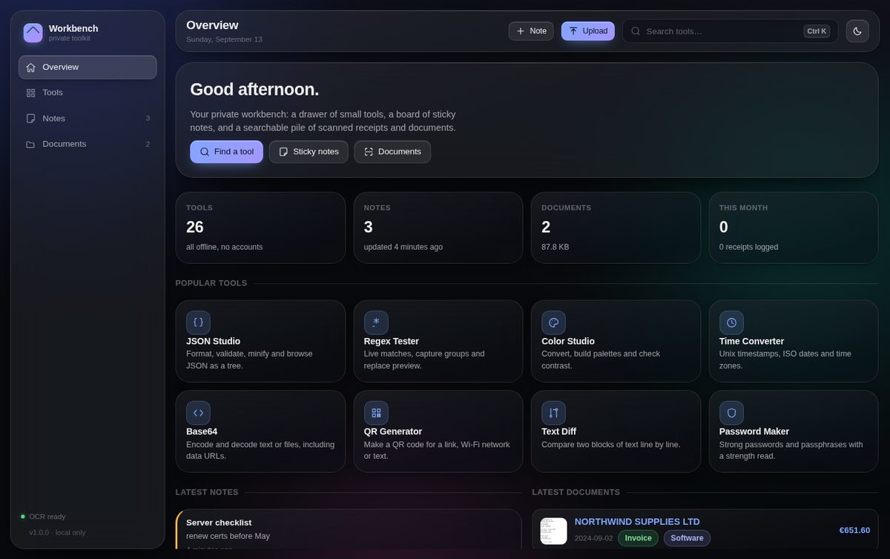
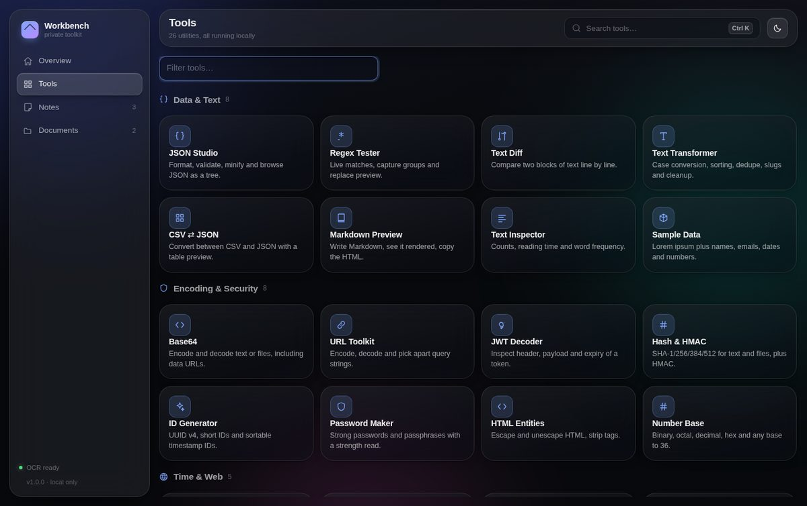
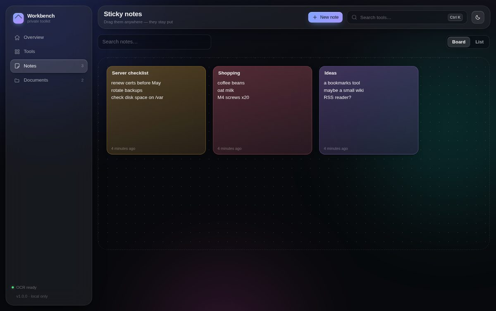
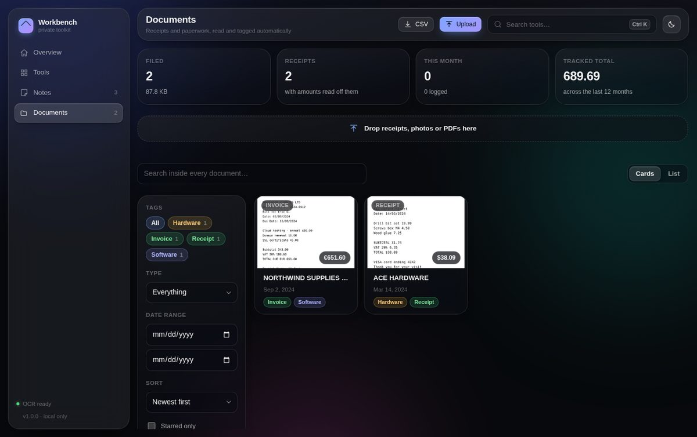

# Workbench

A private toolkit that runs on your own server: a drawer of small utilities, a
board of sticky notes that stay where you put them, and a pile of receipts and
documents that read themselves.

No accounts, no third-party services, no telemetry. Everything — including the
OCR — happens on your machine.



---

## What is in it

### 26 utilities

All of them run in the browser (the only exception is QR rendering, which the
server does). Press <kbd>⌘K</kbd> / <kbd>Ctrl K</kbd> anywhere to jump straight
to one.

| Data & text | Encoding & security | Time & web | Design & media |
| --- | --- | --- | --- |
| JSON Studio | Base64 | Time Converter | Color Studio |
| Regex Tester | URL Toolkit | Cron Explainer | Gradient Maker |
| Text Diff | JWT Decoder | QR Generator | Glass CSS |
| Text Transformer | Hash & HMAC | Subnet Calculator | Image Workshop |
| CSV ⇄ JSON | ID Generator | HTTP Reference | Unit Converter |
| Markdown Preview | Password Maker | | |
| Text Inspector | HTML Entities | | |
| Sample Data | Number Base | | |



### Sticky notes

Drag a note anywhere on the board and it stays there — position, size, colour
and text are saved to the server as you type. There is a list view for when the
board gets busy, plus search, pinning and per-note colours.



### Document & receipt organizer

Drop PDFs or photos anywhere in the app. The server runs OCR over them, then
reads out what it can:

- **Vendor** — the shop or issuer at the top of the page
- **Date** — day-first or month-first, numeric or written out
- **Total** — prefers a line labelled *total* / *amount due*, falls back to the
  largest money-looking figure
- **Currency** — from the symbol or the ISO code
- **Tags** — matched against a keyword list: Hardware, Food, Exams, School,
  Medical, Utilities, Transport, Travel, Electronics, Software, Finance, Taxes,
  Insurance, Housing, Warranty, Legal, Identity, Work, plus Receipt/Invoice

Everything is editable afterwards, every word of the extracted text is
full-text searchable, and the whole pile exports to CSV for bookkeeping.



---

## Deploy it on your Ubuntu server

The one-liner, from a copy of this repository on the server:

```bash
git clone https://github.com/EricGluzman/webtools.git
cd webtools
sudo ./scripts/install.sh tools.yourdomain.com 246813   # the PIN is optional
```

That script:

1. installs `tesseract-ocr`, `poppler-utils` and Node.js 22 if they are missing;
2. creates a `workbench` system user and copies the app to `/opt/workbench`;
3. writes `/opt/workbench/.env` with a **generated login password** (printed at
   the end — write it down), or the PIN you passed as a second argument;
4. installs and starts the `workbench` systemd service on `127.0.0.1:8712`;
5. points an nginx server block at your subdomain.

Then add HTTPS:

```bash
sudo certbot --nginx -d tools.yourdomain.com
```

Point an `A` record for `tools` at your server's IP before running certbot.

### Doing it by hand

<details>
<summary>Manual steps, if you would rather not run the script</summary>

```bash
sudo apt update
sudo apt install -y tesseract-ocr poppler-utils nodejs npm nginx

sudo useradd --system --create-home --home-dir /opt/workbench workbench
sudo rsync -a --exclude node_modules --exclude data ./ /opt/workbench/
cd /opt/workbench
sudo -u workbench npm install --omit=dev
sudo -u workbench cp .env.example .env
sudo -u workbench nano .env          # set WEBTOOLS_PASSWORD

sudo cp scripts/workbench.service /etc/systemd/system/
sudo systemctl enable --now workbench

sudo cp scripts/nginx.conf.example /etc/nginx/sites-available/workbench
sudo sed -i 's/tools.example.com/tools.yourdomain.com/' /etc/nginx/sites-available/workbench
sudo ln -s /etc/nginx/sites-available/workbench /etc/nginx/sites-enabled/
sudo nginx -t && sudo systemctl reload nginx
```

</details>

### Running it locally first

```bash
npm install
npm start           # http://127.0.0.1:8712
```

---

## Configuration

Settings live in `.env` next to the app (see `.env.example`). Restart the
service after changing anything: `sudo systemctl restart workbench`.

| Key | Default | What it does |
| --- | --- | --- |
| `PORT` | `8712` | Port the Node process listens on |
| `HOST` | `127.0.0.1` | Bind address — keep it local when nginx is in front |
| `WEBTOOLS_PIN` | *(empty)* | 4–12 digits. Shows a keypad lock screen. Takes priority over the password |
| `WEBTOOLS_PASSWORD` | *(empty)* | A text password instead. With both empty there is **no lock screen at all** |
| `DATA_DIR` | `./data` | Where the database, uploads and thumbnails live |
| `MAX_UPLOAD_MB` | `40` | Per-file upload limit (also raise `client_max_body_size` in nginx) |
| `TRUST_PROXY` | `1` | Marks the session cookie Secure and honours `X-Forwarded-*` |
| `OCR_LANGS` | `eng` | Tesseract languages, e.g. `eng+deu+ukr` |

### More OCR languages

```bash
sudo apt install tesseract-ocr-deu tesseract-ocr-ukr tesseract-ocr-heb
sudo sed -i 's/^OCR_LANGS=.*/OCR_LANGS=eng+deu+ukr/' /opt/workbench/.env
sudo systemctl restart workbench
```

`apt-cache search tesseract-ocr-` lists everything available.

---

## Day to day

```bash
sudo systemctl status workbench     # is it running
sudo journalctl -u workbench -f     # live logs, including OCR timings
sudo systemctl restart workbench

sudo /opt/workbench/scripts/backup.sh            # one-off backup
sudo /opt/workbench/scripts/backup.sh /mnt/nas   # somewhere else
```

Nightly backups, via `sudo crontab -e`:

```
15 3 * * * /opt/workbench/scripts/backup.sh /var/backups/workbench
```

Updating to a newer version: pull the repository on the server and re-run
`sudo ./scripts/install.sh` — it keeps `.env` and `data/` untouched.

---

## The lock screen

Set a PIN and the site opens on a keypad. Type it on the pad, or just type the
digits on a keyboard — it submits itself on the last one.

```bash
sudo /opt/workbench/scripts/set-pin.sh 246813            # keypad PIN
sudo /opt/workbench/scripts/set-pin.sh --password 'a long passphrase'
sudo /opt/workbench/scripts/set-pin.sh --open            # remove the lock
```

Four digits is only 10,000 combinations, so the lockout is doing the real work:

| Wrong entries | What happens |
| --- | --- |
| 1–4 | "Wrong PIN", after a deliberate 0.4s pause |
| 5 | That visitor is locked out for 1 minute |
| 10 | 5 minutes |
| 15 | 30 minutes |
| 20+ | 1 hour, and it stays there |

At that rate, working through every 4-digit combination would take years. Six
digits costs you two extra taps and multiplies the work by a hundred, so prefer
that if the subdomain is public. Sessions last 30 days in an HttpOnly cookie;
to sign every device out, delete `data/session.key` and restart.

Your actual PIN lives only in `/opt/workbench/.env` on the server, which is
git-ignored. Keep it out of the repository — the numbers in these examples are
deliberately not anyone's real PIN.

## Keyboard shortcuts

| Keys | Action |
| --- | --- |
| <kbd>⌘K</kbd> / <kbd>Ctrl K</kbd> | Command palette — every tool and action |
| <kbd>/</kbd> | Same, when you are not typing in a field |
| <kbd>↑</kbd> <kbd>↓</kbd> <kbd>↵</kbd> | Move through and open a result |
| <kbd>Esc</kbd> | Close the palette, a dialog or the document drawer |

---

## How it is built

```
server/          Node + Express, SQLite (better-sqlite3), no ORM
  ocr.js         tesseract / poppler / sharp pipeline, degrades gracefully
  tagger.js      keyword rules and field extraction — no model, no network
  routes/        notes, documents, QR
public/          Plain ES modules, no build step, no framework, no CDN
  css/           Design tokens, the glass material, layout, views, tools
  js/tools/impl/ One file per tool, loaded on demand
scripts/         install.sh, backup.sh, systemd unit, nginx config
```

Some deliberate choices:

- **No build step.** The browser loads the same files that are in the
  repository, so editing a tool means editing one small file and reloading.
- **The backdrop does not animate.** Continuous motion behind `backdrop-filter`
  forces every glass panel to re-blur on every frame, which pegged a CPU core
  and starved OCR of the processor it needed. It is a still image now, and the
  page costs nothing when idle.
- **OCR runs one file at a time** in a queue, at a lower scheduling priority,
  so a batch of uploads cannot make the rest of the machine unresponsive.
- **PDFs with a text layer skip OCR entirely** via `pdftotext`, which is both
  faster and more accurate than reading pixels.

### Without tesseract installed

The app still runs. Uploads are stored, thumbnails still work for PDFs, and
documents are marked *OCR unavailable* with a note about what to install. The
sidebar shows OCR status at a glance.

---

## Security notes

- `WEBTOOLS_PASSWORD` gates the whole API behind a signed, HttpOnly session
  cookie, with a per-address rate limit on the login endpoint. Leave it empty
  only on a network you trust.
- The app binds to `127.0.0.1` by default, so it is reachable only through
  nginx.
- A strict Content-Security-Policy is served with every response; the page
  loads no external scripts, fonts or styles.
- Uploads are limited by type (images and PDFs) and by size, and are stored
  under random names outside the web root.
- Your data lives in one directory. Copy `data/` and you have copied
  everything.
